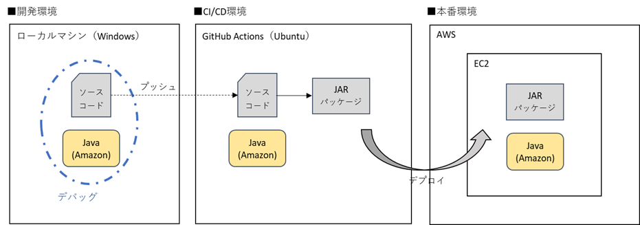
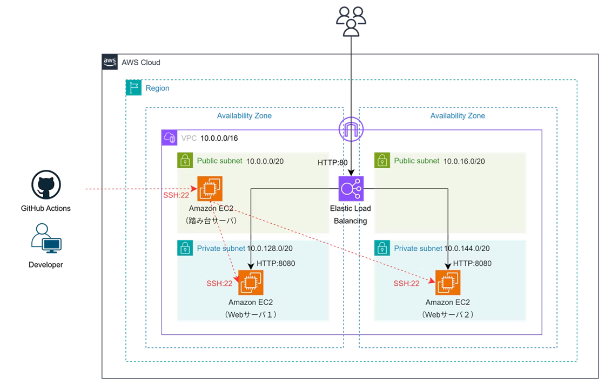

# EC2 + GitHub Actions サンプルアプリ

> AWS と GitHub Actions を使用した、本番環境構築・デプロイに関する Qiita 記事用アプリケーション

## 📝 関連記事

- [【EC2 + GitHub Actions】Spring Boot アプリの本番環境を構築 [前編] - アプリ公開まで](https://qiita.com/okayu__11/items/f2e1e678a4ed0ba44062)
- [【EC2 + GitHub Actions】Spring Boot アプリの本番環境を構築 [後編] - CI/CD パイプライン構築](https://qiita.com/okayu__11/items/a7c508af3032e3b1ec6e)

## 🚀 クイックスタート

### 1. リポジトリのクローン

```bash
git clone https://github.com/y1221/qiita-spring-ec2.git
cd your-repo
```

### 2. アプリケーションの起動

```bash
# ファイルの実行権限付与
chmod u+x mvnw

# 実行
./mvnw spring-boot:run
```

### 3. アクセス

http://localhost:8080

## 🛠️ 技術スタック

### バックエンド

- **言語**: Java 21
- **フレームワーク**: Spring Boot 3.4.5
- **テンプレートエンジン**: Thymeleaf

### 開発ツール

- **ビルドツール**: Maven 3.9.9

### インフラ

- **クラウド**: AWS
- **CI/CD**: GitHub Actions

## 🏗️ システム構成

### 環境全体図



### AWS インフラ構成



## ⚙️ 前提条件

### 必要なソフトウェア

- **JDK**: 21 以上（開発時使用: JDK 21）

### 検証済み環境

- Ubuntu 24.04 LTS
- Windows 11 Home

## 👨‍💻 作者

**おかゆ**


- GitHub: [@y1221](https://github.com/y1221)
- Qiita: [@okayu\_\_11](https://qiita.com/okayu__11)
- X: [@okayu\_\_11](https://twitter.com/okayu__11)
